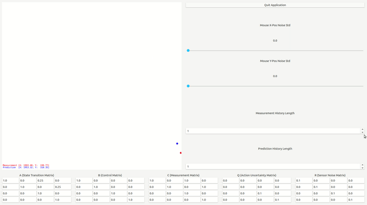

# Filter Visualizer

---

### About
This repository was initiated to study and code the filters for an estimation base on only using a mouse pointer position on the screen. By changing the parameters of the filters, one can observe the change in the estimation of the mouse position. This application can serve as a good visualizer for filters. I hope this can be useful for people who are trying to study or implement filters. GUI layout referenced [Kalman Filter Simulation](https://www.cs.utexas.edu/~teammco/misc/kalman_filter/).

Kalman filter is the only filter available now. More filter can be added later in **filterLib.py**

---

### Dependencies:
* [numpy](http://www.numpy.org/)
* [pyqtgraph](http://www.pyqtgraph.org/)

---

---
### Resources
* Kalman Filter
    1. [Understanding the Basis of the Kalman Filter Via a Simple and Intuitive Derivation](https://courses.engr.illinois.edu/ece420/sp2017/UnderstandingKalmanFilter.pdf)
    2. [Understanding Kalman Filters YouTube Playlist by MATLAB](https://www.youtube.com/watch?v=mwn8xhgNpFY&list=PLn8PRpmsu08pzi6EMiYnR-076Mh-q3tWr)
    3. [Kalman Filter Simulation](https://www.cs.utexas.edu/~teammco/misc/kalman_filter/)

--- 